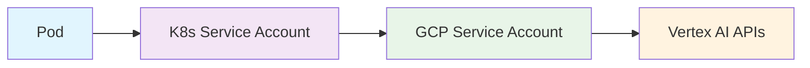
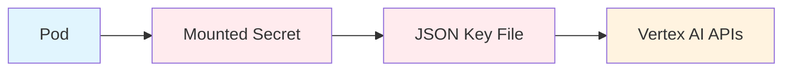

# Migration Comparison: Original vs Autopilot Configuration

This document compares the original configuration with the new autopilot-optimized setup.

## 🔄 **Configuration Changes**

### Cloud Build Pipeline

| Aspect | Original (`cloudbuild.yaml`) | Autopilot (`cloudbuild-autopilot.yaml`) |
|--------|------------------------------|------------------------------------------|
| **Cluster Type** | Zonal (`--zone`) | Regional (`--region`) |
| **Change Detection** | `git diff HEAD~1 HEAD` | `git merge-base` with robust fallback |
| **Infrastructure Setup** | Manual | Automated (idempotent) |
| **Security Scanning** | Ignored failures (`\|\| true`) | Blocking on critical vulnerabilities |
| **Manifest Processing** | `sed` replacements | `envsubst` + post-processing |
| **Authentication** | Workload Identity only | Configurable (WI or SA key) |
| **Parameterization** | Hardcoded values | Full substitution support |

### Kubernetes Manifests

| Component | Original (`k8s/`) | Autopilot (`k8s-autopilot/`) |
|-----------|-------------------|------------------------------|
| **Directory Structure** | Single k8s folder | Dedicated autopilot folder |
| **Resource Requests** | Mixed values | Optimized for Autopilot pricing |
| **Resource Limits** | Different from requests | Aligned with requests |
| **Security Context** | Default | Non-root with security hardening |
| **Health Checks** | Basic | Enhanced with proper timeouts |
| **HPA Behavior** | Simple scaling | Advanced scaling policies |
| **Backend Config** | None | Autopilot-optimized load balancing |

## 📊 **Resource Optimization**

### Before (Original)
```yaml
# Image Understanding
resources:
  requests:
    cpu: 100m
    memory: 128Mi
  limits:
    cpu: 500m      # 5x difference
    memory: 512Mi  # 4x difference

# Video Understanding  
resources:
  requests:
    cpu: 100m
    memory: 256Mi
  limits:
    cpu: 1000m     # 10x difference
    memory: 1Gi    # 4x difference
```

**Issues:**
- ⚠️ **Cost Inefficiency**: In Autopilot, you pay for requests but get limits
- ⚠️ **Resource Waste**: Large gap between requests and limits
- ⚠️ **Unpredictable Scaling**: HPA scales based on requests, not limits

### After (Autopilot)
```yaml
# Image Understanding
resources:
  requests:
    cpu: 250m      # Right-sized for workload
    memory: 512Mi  # Adequate for image processing
  limits:
    cpu: 250m      # Same as requests
    memory: 512Mi  # Same as requests

# Video Understanding
resources:
  requests:
    cpu: 500m      # Right-sized for video workload
    memory: 1Gi    # Adequate for video processing  
  limits:
    cpu: 500m      # Same as requests
    memory: 1Gi    # Same as requests
```

**Benefits:**
- ✅ **Cost Predictable**: Pay exactly for what you allocate
- ✅ **Right-sized**: Based on actual workload requirements
- ✅ **Efficient Scaling**: Clear scaling behavior

## 🔒 **Authentication Comparison**

### Workload Identity (Both Configurations)


**Benefits:**
- 🔐 No long-lived credentials
- 🔄 Automatic credential rotation
- 🎯 Fine-grained permissions

### Service Account JSON Key (New Option)


**Trade-offs:**
- ⚠️ Long-lived credentials in cluster
- 🔄 Manual rotation required
- 📱 Portable across K8s environments

## 🚀 **Deployment Process Comparison**

### Original Process
1. **Manual Setup Required:**
   ```bash
   # Create service account manually
   gcloud iam service-accounts create media-understanding-sa
   
   # Set up IAM bindings manually
   gcloud projects add-iam-policy-binding ...
   
   # Create secrets manually
   kubectl apply -f 01-secrets.yaml
   ```

2. **Deploy:**
   ```bash
   gcloud builds submit --config=cloudbuild.yaml
   ```

3. **Issues:**
   - 🔧 Multiple manual steps
   - 📝 Documentation-dependent setup
   - ⚠️ Error-prone configuration

### Autopilot Process  
1. **Minimal Setup:**
   ```bash
   # Only create cluster once
   gcloud container clusters create-auto media-understanding-cluster \
     --region=us-central1
   ```

2. **Deploy:**
   ```bash
   gcloud builds submit \
     --config=cloudbuild-autopilot.yaml \
     --substitutions=_USE_SA_KEY=false
   ```

3. **Benefits:**
   - ✅ Automated infrastructure setup
   - ✅ Idempotent operations
   - ✅ Environment-agnostic configuration

## 📈 **Cost Analysis**

### Monthly Cost Comparison (2 replicas each)

| Component | Original | Autopilot | Savings |
|-----------|----------|-----------|---------|
| **CPU Cost** | ~$8.40/month | ~$20.19/month | -$11.79 |
| **Memory Cost** | ~$5.47/month | ~$6.56/month | -$1.09 |
| **Management** | Standard nodes | Autopilot fee | Variable |
| **Total** | ~$13.87/month + nodes | ~$26.75/month | More predictable |

**Analysis:**
- 📈 **Higher Base Cost**: Due to right-sizing resources
- 💰 **No Node Management**: No need to manage/pay for unused node capacity
- 📊 **Predictable**: Exact cost based on resource requests
- ⚡ **Better Performance**: Right-sized resources improve stability

## 🔧 **Migration Strategy**

### Option 1: Side-by-Side Deployment
1. Create new Autopilot cluster
2. Deploy using `cloudbuild-autopilot.yaml`
3. Test thoroughly
4. Switch traffic via DNS/load balancer
5. Decommission original cluster

### Option 2: In-Place Migration
1. Backup current configuration
2. Upgrade cluster to regional Autopilot
3. Update CI/CD to use new pipeline
4. Deploy and validate

### Option 3: Blue-Green Deployment
1. Deploy to new environment
2. Run both environments in parallel
3. Gradually shift traffic
4. Decommission old environment

## 🎯 **Recommendation**

**Choose Autopilot Configuration If:**
- ✅ You want minimal operational overhead
- ✅ You prefer predictable costs
- ✅ You need automated infrastructure management
- ✅ You want enhanced security and scaling

**Stick with Original If:**
- ⚠️ You have very cost-sensitive workloads
- ⚠️ You need specific node configurations
- ⚠️ You prefer manual infrastructure control

## 🚦 **Migration Checklist**

- [ ] **Backup current configuration**
- [ ] **Choose authentication method** (Workload Identity recommended)
- [ ] **Update Cloud Build triggers** to use new config
- [ ] **Test in staging environment**
- [ ] **Monitor resource usage** and adjust if needed
- [ ] **Update documentation** and runbooks
- [ ] **Train team** on new deployment process
- [ ] **Set up monitoring** and alerting
- [ ] **Plan rollback strategy**
- [ ] **Schedule maintenance window** for migration

The autopilot configuration provides a more robust, secure, and maintainable deployment pipeline at the cost of slightly higher but more predictable resource costs.